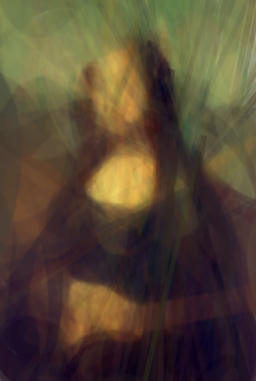
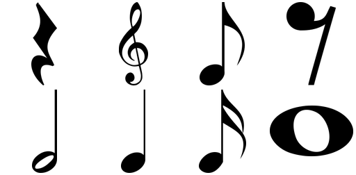

# diff-rendering



Every couple of years I seam to come across a project that renders an image from basic shapes. The earliest that I know
of is by [Roger Johansson](https://rogerjohansson.blog/2008/12/07/genetic-programming-evolution-of-mona-lisa/) in 2008,
which used an evolution algorithm to place the triangles optimally. Recently I decided to replicate this project, but
since we live in the age of AI I used gradient decent to find the optimum. Also why only using triangles? Can we use any
arbitrary shape?

To calculate the gradients I use the magic of pytorch's
[grid_sample](https://docs.pytorch.org/docs/2.11/generated/torch.nn.functional.grid_sample.html). This function takes a
deformation grid and wraps an image to it while propagating the gradients. For this project the deformation is an affine
matrix generated and optimized for each iteration.

The shapes can be any set of black and white images with alpha. In this example I used musical shapes.



# Installation and usage

I use [uv](https://docs.astral.sh/uv/) to manage the dependencies. Assuming uv is installed you can run the program by
just doing

```shell
uv run main.py input_image \
               output_dir \
               [--source_dir SOURCE_DIR] \
               [--output_dir OUTPUT_DIR] \
               [--saliency_map SALIENCY_MAP] \
               [--steps STEPS] \
               [--lr LR] \
               [--inner_steps INNER_STEPS] \
               [--seed SEED]
```

The options are available:

```
positional arguments:
  input_image           Path to the input image
  output_dir            Directory to save output images

options:
  -h, --help            show this help message and exit
  --source_dir SOURCE_DIR
                        Directory containing source images
  --saliency_map SALIENCY_MAP
                        Path to the saliency map image
  --steps STEPS         Number of optimization steps
  --lr LR               Learning rate for optimization
  --inner_steps INNER_STEPS
                        Number of inner optimization steps per source image
  --seed SEED           Random seed for reproducibility

```

# LICENCE

The code is licence under the MIT licence

I don't own the copyright for the musical shape images